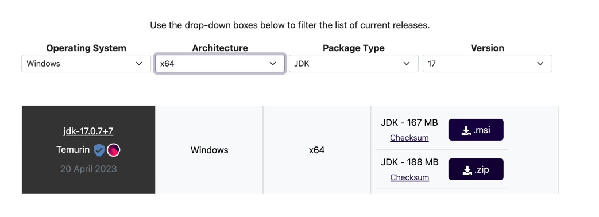

# Java Hangman API 

In this partial implementation the technologies used are:

- Java version 17
- [Spark](http://sparkjava.com/)
  - Spark is a micro web framework that is used to expose API endpoints.
- [Gson](https://github.com/google/gson) 
  - GSON is a framework from google that we use to convert to & from JSON.
- JUnit version 4

## How to: Run Application

- Please refer to the specific section that matches your machine! Windows or macOS/Linux
- Please skip Installer sections if you already have the following installed:
  - Java 17
  - Gradle

### Installer via Windows

1. Install Java 17

To install OpenJDK 17 on Windows, follow these steps:

- Visit the Adoptium website at https://adoptium.net/.

- Click on the "Other platforms and versions" button.

- Choose the installer appropriate for your system architecture (x86 or x64) and click the "zip" button.
- Once the download is complete, locate the installer file and run it. 
- Follow the installation wizard instructions and select the desired installation location. 
- After the installation is complete, open a new command prompt to ensure the changes take effect.

Verify the OpenJDK installation by running the following command:

    java -version

2. Install Gradle (this step is optional, if Gradle not installed `./gradlew` must replace `gradle` for running the application )

To install Gradle on Windows, follow these steps:

Visit the Gradle website at https://gradle.org/install/.

- Scroll down to the "Installing manually" section.

- Click on the "Complete Distribution" link to download the latest Gradle version (ZIP archive) for Windows.

- Once the download is complete, extract the contents of the ZIP archive to a directory of your choice. For example, C:\gradle.

- Right-click on the Windows Start button and select "System".

- Click on "Advanced system settings" and go to the "Advanced" tab.

- Click on the "Environment Variables" button.

- In the "System Variables" section, click on "New" to create a new variable.

- Set the variable name as GRADLE_HOME and the variable value as the Gradle installation directory path. For example, C:\gradle.

- Select the Path variable in the "System Variables" section and click on "Edit".

- Add the following entry at the end of the "Variable value" field:
  `;%GRADLE_HOME%\bin`
  
- Click "OK" to save the changes and close all the open windows.

Open a new command prompt to ensure the changes take effect.

Verify the Gradle installation by running the following command: `gradle --version`

You should see the Gradle version information, confirming that Gradle is installed on your Windows machine.

### Installer via macOs/Linux

Follow the steps below to install Gradle and Java 17 via SDKMAN:

1. Install SDKMAN 
   - SDKMAN is a tool that manages multiple software development kits (SDKs) and provides a convenient way to install and switch between different versions of tools. 
   - To install SDKMAN, execute the following command in your terminal:

    curl -s "https://get.sdkman.io" | bash

Once the installation is complete, close and reopen your terminal or run the following command to start using SDKMAN:

    source "$HOME/.sdkman/bin/sdkman-init.sh"

2. Install Java 17
   
After installing SDKMAN, you can use it to install Java 17. Run the following command to install Java 17:

    sdk install java 17.0.1-open

To verify that Java 17 is installed successfully, run the following command:

    java -version

You should see the Java version information, indicating that Java 17 is now the default version.

3. Install Gradle (this step is optional, if Gradle not installed we can use the gradle wrapper. `./gradlew` must replace `gradle` for running the application in the steps below)

With SDKMAN, you can easily install Gradle. Execute the following command to install Gradle:

    sdk install gradle

After the installation completes, verify the installation by running:

    gradle --version

You should see the Gradle version information, confirming that Gradle is installed and available.

## Running the Java Application

To run the Java service using the Gradle wrapper, follow these steps:

- Navigate to the root directory of your Java service project in the terminal/command line. For this repository the command would be:
  - `cd java`

1. Run the following command to install the services dependencies: `gradle dependencies`
2. Run the following command to start up the application: `gradle run`
3. (optional) Run the following command to execute the unit tests: `gradle test`

NOTE: if using the gradle wrapper (which doesn't require installing gradle, replace the above gradle commands with ./gradlew)

The app should now be available at: `http://localhost:4567`

Happy coding :) 